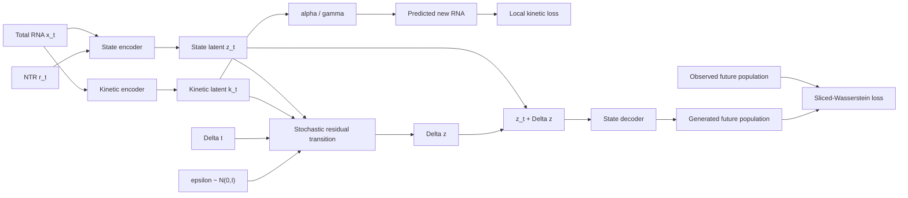

<h1 align="center">TrajectoryFlow</h1>
<p align="center"><strong>Kinetically guided stochastic population forecasting from metabolic-labeling single-cell RNA</strong></p>
<p align="center">A research framework for learning future cell-state distributions from time-resolved SCI-FATE2 snapshots without assuming cell-to-cell correspondences across time.</p>
<p align="center">
  
  
  
  
</p>

---

## Overview

**TrajectoryFlow** studies how cellular populations change over time using time-resolved single-cell RNA measurements.

The main model is a **dual-scale stochastic residual model**. It combines:

- a **state representation** from total RNA and NTR,
- a **local kinetic representation** learned from total RNA and supervised with newly synthesized RNA,
- a **one-step stochastic residual transition** in latent space,
- and **population-level Sliced-Wasserstein training** between generated and observed future cell populations.

The current implementation does **not** use the earlier latent-diffusion transition. The generative transition is now a direct stochastic residual MLP.

The central setting is difficult because single-cell measurements are destructive: cells measured at time $t$ are not the same cells measured at $t+\Delta t$. TrajectoryFlow therefore treats timepoints as **unpaired populations**, not as known cell lineages.

---

## Core idea

For a source cell at time $t$,

$$
z_t = E_{\mathrm{state}}(x_t, r_t)
$$

represents the current state, while

$$
k_t = E_{\mathrm{kin}}(x_t)
$$

represents local transcriptional information.

The future latent state is generated through a stochastic residual transition,

$$
\epsilon \sim \mathcal{N}(0,I),
$$

$$
\Delta z =
\Delta t\,
G_\theta(z_t,k_t,\Delta t,\epsilon),
$$

$$
z_{t+\Delta t}=z_t+\Delta z.
$$

The future total-RNA state is then decoded as

$$
\hat{x}_{t+\Delta t}=D(z_{t+\Delta t}).
$$

Training combines three objectives:

- **Reconstruction loss** preserves the current cell state.
- **Kinetic loss** makes the kinetic representation predictive of newly synthesized RNA.
- **Sliced-Wasserstein loss** matches generated and observed future populations without introducing artificial cell pairs.



---

# Quick start

## 1. Clone and create an environment

```bash
git clone https://github.com/ZanderNic/TrajectoryFlow
cd TrajectoryFlow
python3 -m venv .venv
source .venv/bin/activate
python -m pip install --upgrade pip
pip install -e .
```

For development and tests, if the repository defines the development extra:

```bash
pip install -e ".[dev]"
```

TrajectoryFlow has been developed with Python 3.12.

A CUDA-capable GPU is recommended for the larger benchmark runs, but the framework also supports CPU execution through the benchmark configuration.

---

# SCI-FATE2 dataset

TrajectoryFlow is built around the SCI-FATE2 dataset from Maizels et al.

- **GEO accession:** [GSE236512](https://www.ncbi.nlm.nih.gov/geo/query/acc.cgi?acc=GSE236512)
- **Paper:** [Reconstructing developmental trajectories using latent dynamical systems and time-resolved transcriptomics](https://doi.org/10.1016/j.cels.2024.04.004)

The repository downloads the data directly from GEO. The preprocessing script supports the published `estimate`, `counting`, and `splicing` H5AD files.

## Download and preprocess

The default setup uses the `estimate` dataset and keeps the 10,000 most frequently detected genes:

```bash
python scripts/download_scifate2.py
```

This is equivalent to:

```bash
python scripts/download_scifate2.py \
   --dataset estimate \
   --work-dir data/raw \
   --output-dir data/processed/scifate2 \
   --top-genes-by-detection 10000
```

To additionally reconstruct and merge the authors' published cell annotations:

```bash
python scripts/download_scifate2.py \
   --dataset estimate \
   --authors-cell-types
```

If disk space is limited, the downloaded H5AD can be removed after preprocessing:

```bash
python scripts/download_scifate2.py \
   --dataset estimate \
   --delete-h5ad
```

To preprocess an already downloaded H5AD instead:

```bash
python scripts/download_scifate2.py \
   --h5ad-path /path/to/file.h5ad
```

Useful options include:

```text
--min-cells
--min-gene-nonzero-fraction
--top-genes-by-detection
--clip-ratio
--authors-cell-types
--cell-annotations
--uncompressed-npz
--force-download
--force-process
```

Run

```bash
python scripts/download_scifate2.py --help
```

for the full list.

## Processed data layout

The preprocessing step stores every timepoint independently and keeps the matrices sparse:

```text
data/processed/scifate2/
├── manifest.json
├── preprocessing.json
├── selected_gene_indices.npy
├── genes.*
├── 5h/
│   ├── expression.npz
│   ├── new.npz
│   ├── ntr.npz
│   └── obs.*
├── 10h/
│   └── ...
├── 15h/
│   └── ...
└── ...
```

The same selected genes and gene ordering are used across all timepoints.

`expression.npz`, `new.npz`, and `ntr.npz` are stored as SciPy CSR matrices and only sampled rows are materialized densely during training. This is important for keeping the full dataset manageable in memory.

---

# Running the benchmarks

Benchmarks are defined in TOML files and executed with:

```bash
python scripts/run_benchmark.py path/to/config.toml
```
Useful flags:

```bash
# Start from a clean output directory
python scripts/run_benchmark.py path/to/config.toml --overwrite
# Resume completed experiments when config/data/code still match
python scripts/run_benchmark.py path/to/config.toml --resume
```

---

## Main benchmark

The main benchmark compares:

1. **No Change** — predicts the source population as the future population
2. **Velvet** — VelvetVAE + VelvetSDE baseline
3. **Dual Scale Full** — the proposed stochastic residual model

The main strict extrapolation experiment trains on:

```text
5h, 10h, 15h
```

and evaluates:

```text
15h -> 20h
```

with the 20h population completely hidden during training.

Recommended config location:

```text
configs/benchmark_main_stochastic_residual.toml
```

Run:

```bash
python scripts/run_benchmark.py \
   configs/benchmark_main_stochastic_residual.toml \
   --overwrite
```

---

## Kinetic ablation study

The ablation study uses a $2\times2$ design:

| Model | Kinetic encoder | Local kinetic loss |
|---|---:|---:|
| `dual_scale_no_kin_no_local` | no | no |
| `dual_scale_kin_no_local` | yes | no |
| `dual_scale_no_kin_local` | no | yes |
| `dual_scale_full` | yes | yes |

This separates the effect of the cell-specific kinetic representation from the effect of direct local supervision with newly synthesized RNA.

Recommended config location:

```text
configs/benchmark_dual_scale_kinetic_ablation_stochastic.toml
```

Run:

```bash
python scripts/run_benchmark.py \
   configs/benchmark_dual_scale_kinetic_ablation_stochastic.toml \
   --overwrite
```

> **Important:** NTR is already an input to the state encoder. The ablation therefore measures the additional contribution of the separately supervised kinetic branch, not the total contribution of metabolic-labeling information.

---

# Velvet baseline

TrajectoryFlow contains its own PyTorch implementation/adaptation of the Velvet components used for benchmarking.

The benchmark implementation is kept inside:

```text
src/trajectoryflow/models/baselines/velvet/
```

It does not require the official `velvetvae` package for normal TrajectoryFlow benchmark execution.

The official Velvet repository is:

[github.com/rorymaizels/velvetVAE](https://github.com/rorymaizels/velvetVAE)

The included validator can compare core numerical components against a pinned official reference environment:

```bash
python scripts/validate_velvet_equivalence.py
```

For TrajectoryFlow-only regression checks:

```bash
python scripts/validate_velvet_equivalence.py --self-only
```

This validation does not imply that independently trained models, complete training trajectories, or reported paper scores are bitwise-identical to the original implementation.

---

# Project structure

```text
TrajectoryFlow/
├── src/
│   └── trajectoryflow/
│       ├── data/
│       │   ├── scifate2.py
│       │   ├── scifate2_annotations.py
│       │   ├── store.py
│       │   └── ...
│       ├── models/
│       │   ├── dual_scale/
│       │   │   ├── components.py
│       │   │   ├── config.py
│       │   │   ├── losses.py
│       │   │   └── model.py
│       │   └── baselines/
│       │       ├── no_change.py
│       │       └── velvet/
│       ├── training/
│       │   ├── dual_scale.py
│       │   ├── dual_scale_data.py
│       │   ├── velvet.py
│       │   └── progress.py
│       ├── evaluation/
│       │   ├── evaluator.py
│       │   └── metrics/
│       ├── experiment/
│       │   ├── config.py
│       │   ├── data.py
│       │   ├── models.py
│       │   ├── runner.py
│       │   ├── runtime.py
│       │   └── split.py
│       └── plotting/
│           ├── paper.py
│           ├── dual_scale.py
│           └── ...
├── scripts/
│   ├── download_scifate2.py
│   ├── run_benchmark.py
│   ├── analyze_benchmark.py
│   ├── plot_benchmark.py
│   ├── plot_dual_scale.py
│   ├── prepare_direction_references.py
│   ├── prepare_cbd_reference.py
│   └── validate_velvet_equivalence.py
├── configs/
│   ├── benchmark_main_stochastic_residual.toml
│   └── benchmark_dual_scale_kinetic_ablation_stochastic.toml
├── tests/
├── data/
└── runs/
```

---

# Testing

Run the full test suite with:

```bash
pytest -q
```

Individual groups can also be run separately:

```bash
pytest tests/models -q
pytest tests/training -q
pytest tests/evaluation -q
pytest tests/experiment -q
pytest tests/data -q
pytest tests/scripts -q
```

Some optional plotting or reference-generation functionality may require additional scientific Python packages beyond the minimal core environment.

---

# Research scope and limitations

This repository is research code and the proposed model is experimental.

The current study focuses on SCI-FATE2 and population-level forecasting. In particular:

- cross-time supervision is distributional rather than cell-paired,
- the model does not recover experimentally observed individual trajectories,
- stochastic predictions are not lineage assignments,
- the learned $\alpha$ and $\gamma$ values are effective kinetic parameters rather than uniquely identified biological rates,
- the current main evaluation is a strict early-time extrapolation experiment,
- generalization to other biological systems requires additional datasets and experiments.

---

# References

**SCI-FATE2 / Velvet**

R. Maizels et al., **Reconstructing developmental trajectories using latent dynamical systems and time-resolved transcriptomics**, Cell Systems, 2024.

https://doi.org/10.1016/j.cels.2024.04.004

Dataset:

https://www.ncbi.nlm.nih.gov/geo/query/acc.cgi?acc=GSE236512

**Official Velvet implementation**

https://github.com/rorymaizels/velvetVAE

---

# AI assistance

OpenAI ChatGPT (GPT-5.6 Sol) was used as an AI-assisted tool during this project. It supported big parts of the software implementation, including code generation, refactoring, debugging, and documentation.

All methodological decisions, experimental design, interpretation of results, verification of sources, and final project content were reviewed and determined by the author.
